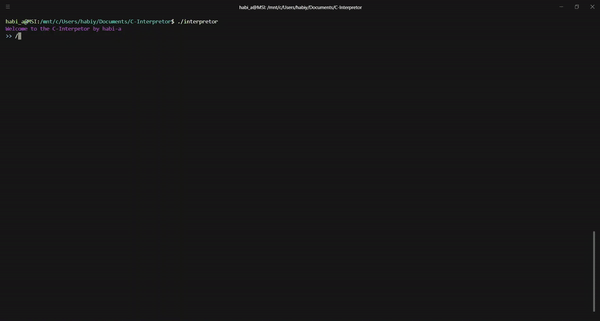

# C-Interpretor
An interpreter in C

NOTE: Ugly code

## Install
* Clone the project
* Compile sources with make
>  $> make
* Run the interpreter
>  $> ./interpretor

## TO-DO List
* FOR/WHILE
* FUNCTIONS
* STRUCT
* TYPEDEF
* POINTER
